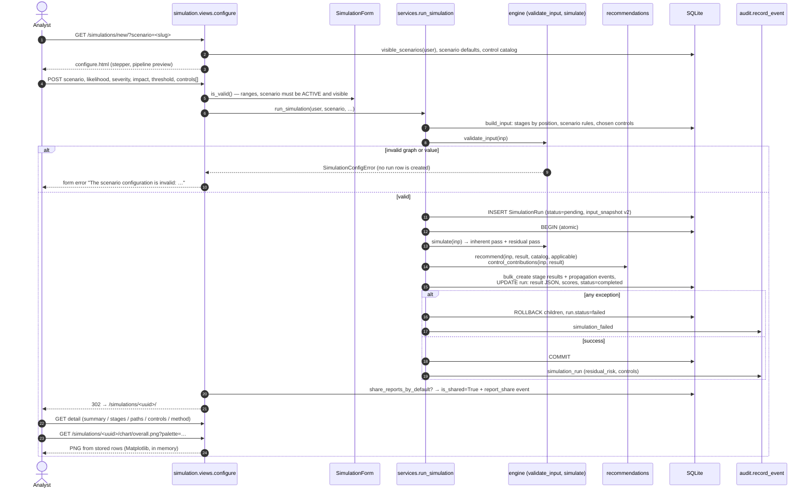
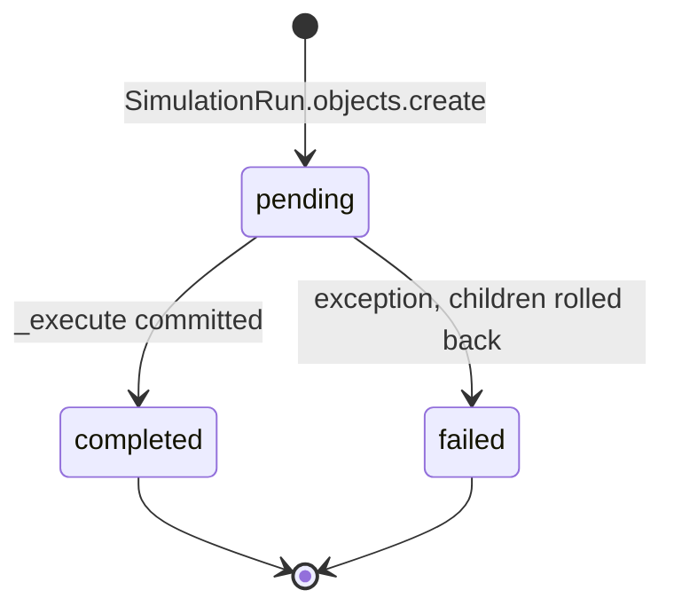

# Diagram: simulation workflow (form to report)

```mermaid
sequenceDiagram
    autonumber
    actor An as Analyst
    participant CV as simulation.views.configure
    participant SF as SimulationForm
    participant SV as services.run_simulation
    participant EN as engine (validate_input, simulate)
    participant RC as recommendations
    participant DB as SQLite
    participant AU as audit.record_event

    An->>CV: GET /simulations/new/?scenario=<slug>
    CV->>DB: visible_scenarios(user), scenario defaults, control catalog
    CV-->>An: configure.html (stepper, pipeline preview)
    An->>CV: POST scenario, likelihood, severity, impact, threshold, controls[]
    CV->>SF: is_valid() — ranges, scenario must be ACTIVE and visible
    CV->>SV: run_simulation(user, scenario, …)
    SV->>DB: build_input: stages by position, scenario rules, chosen controls
    SV->>EN: validate_input(inp)
    alt invalid graph or value
        EN-->>CV: SimulationConfigError (no run row is created)
        CV-->>An: form error "The scenario configuration is invalid: …"
    else valid
        SV->>DB: INSERT SimulationRun (status=pending, input_snapshot v2)
        SV->>DB: BEGIN (atomic)
        SV->>EN: simulate(inp) → inherent pass + residual pass
        SV->>RC: recommend(inp, result, catalog, applicable)<br/>control_contributions(inp, result)
        SV->>DB: bulk_create stage results + propagation events,<br/>UPDATE run: result JSON, scores, status=completed
        alt any exception
            SV->>DB: ROLLBACK children, run.status=failed
            SV->>AU: simulation_failed
        else success
            SV->>DB: COMMIT
            SV->>AU: simulation_run (residual_risk, controls)
        end
        CV->>DB: share_reports_by_default? → is_shared=True + report_share event
        CV-->>An: 302 → /simulations/<uuid>/
        An->>CV: GET detail (summary / stages / paths / controls / method)
        An->>CV: GET /simulations/<uuid>/chart/overall.png?palette=…
        CV-->>An: PNG from stored rows (Matplotlib, in memory)
    end
```

Run states (`simulation.models.RunStatus`):

```mermaid
stateDiagram-v2
    [*] --> pending: SimulationRun.objects.create
    pending --> completed: _execute committed
    pending --> failed: exception, children rolled back
    completed --> [*]
    failed --> [*]
```
